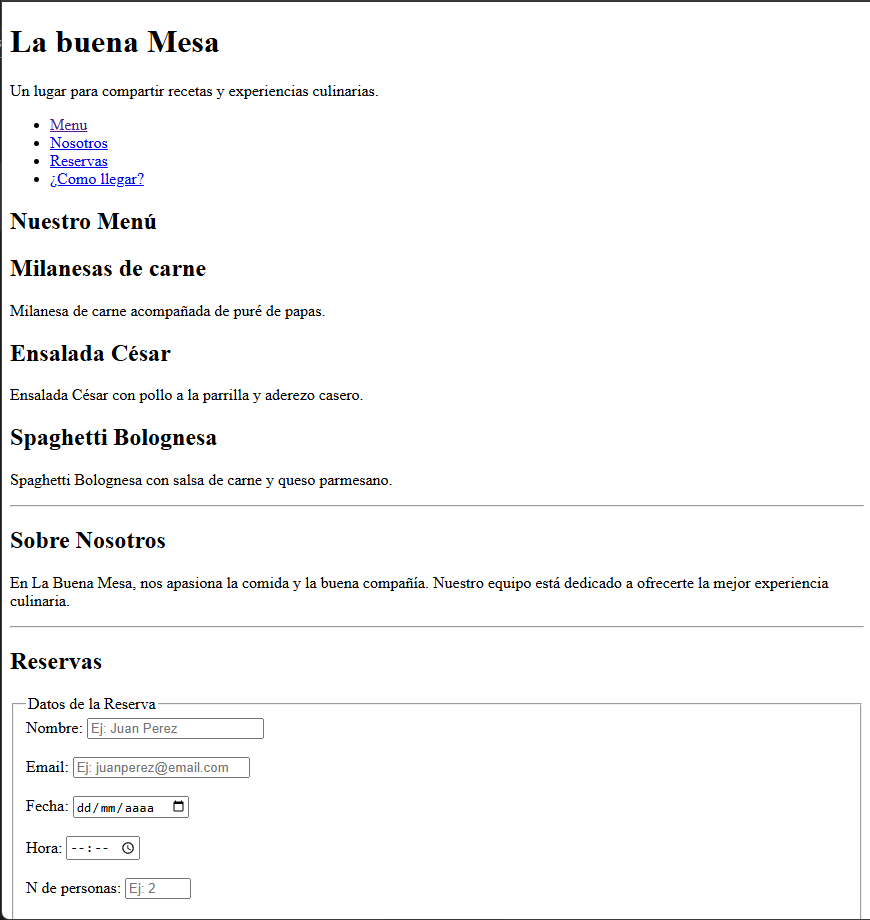
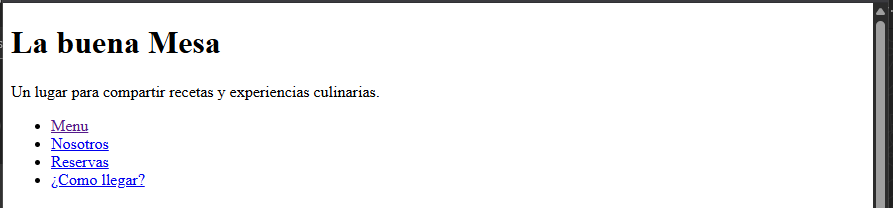
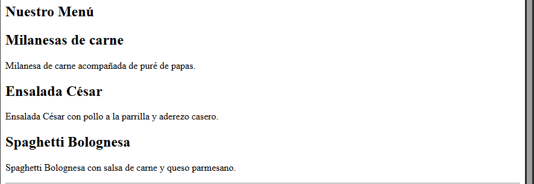
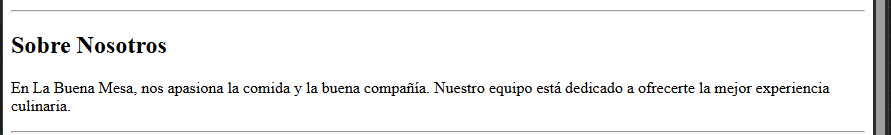
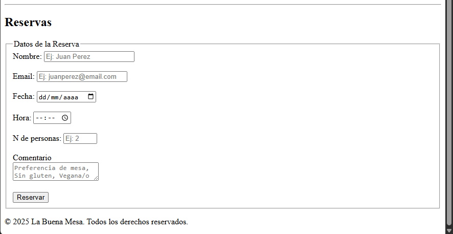
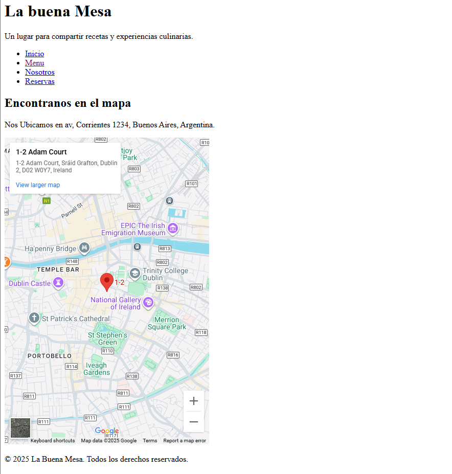

# La Buena Mesa - Proyecto Final

Santiago Ruben Sordi

## Descripción
Página web desarrollada para el restaurante "La Buena Mesa" como proyecto final de Programación III. El sitio incluye información del menú, formulario de reservas y ubicación del restaurante.

## GitHub
https://github.com/sordi005/Practico-html-LaBuenaMesa

## Estructura del Proyecto
```
La_buena_mesa/
├── index.html          # Página principal
├── ubicacion.html      # Página de ubicación con mapa
├── capturas/           # Carpeta con imágenes del proyecto
│   ├── pagina-completa.png
│   ├── header-nav.png
│   ├── menu.png
│   ├── nosotros.png
│   ├── formulario.png
│   └── ubicacion.png
└── README.md          # Este archivo
```

## Capturas de Pantalla

### Vista Completa de la Página Principal


*Vista general completa del sitio web mostrando todas las secciones: header, menú, sobre nosotros y formulario de reservas*

---

### Header y Navegación


*Encabezado del sitio con el nombre del restaurante y navegación principal con enlaces a las diferentes secciones (Menú, Nosotros, Reservas) y página de ubicación*

---

### Sección Menú


*Carta del restaurante mostrando los platos principales:*
- **Milanesas de carne**: Acompañada de puré de papas
- **Ensalada César**: Con pollo a la parrilla y aderezo casero
- **Spaghetti Bolognesa**: Con salsa de carne y queso parmesano

---

### Sección Sobre Nosotros


*Breve descripción de la filosofía del restaurante y compromiso con la calidad culinaria*

---

### Formulario de Reservas


*Formulario interactivo con los siguientes campos:*
- **Nombre**: Campo de texto con placeholder
- **Email**: Validación de formato de correo
- **Fecha**: Selector de fecha tipo calendario
- **Hora**: Selector de hora
- **Número de personas**: Campo numérico (1-20 personas)
- **Comentarios**: Área de texto para preferencias especiales
- **Botón de envío**: Para confirmar la reserva

---

### Página de Ubicación


*Página dedicada con:*
- Mapa interactivo de Google Maps
- Dirección: Av. Corrientes 1234, Buenos Aires, Argentina
- Navegación idéntica a la página principal
- Footer con derechos reservados

## Características Implementadas

### HTML5 Semántico
- ✅ Estructura con `<header>`, `<nav>`, `<main>`, `<section>`, `<aside>`, `<footer>`
- ✅ Uso correcto de encabezados (`<h1>`, `<h2>`)
- ✅ Formulario con `<fieldset>` y `<label>`

### Navegación
- ✅ Enlaces internos con anclas (#menu, #nosotros, #reservas)
- ✅ Enlace externo a página de ubicación
- ✅ Navegación consistente en todas las páginas

### Formulario
- ✅ Validaciones HTML5 nativas
- ✅ Atributos `required` en campos obligatorios
- ✅ Placeholders descriptivos
- ✅ Tipos de input apropiados (text, email, date, time, number)

## Validación del Código
El código HTML ha sido estructurado siguiendo las mejores prácticas de:
- Semántica HTML5
- Accesibilidad web
- Validación de formularios
- Organización clara del contenido

---
*Proyecto desarrollado como trabajo final de html en la materia Programación III - 2025*